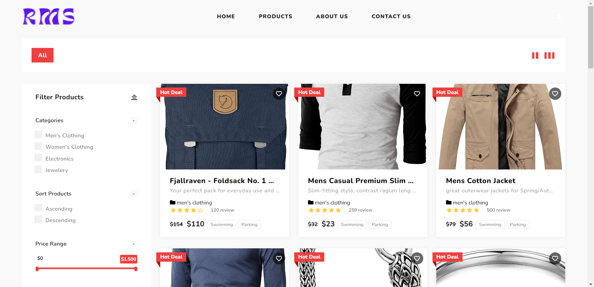

# Products Page

In this page there are a list of products shown. Here we can filter the products using the fields in filter section.


## Installation

Step 1: Download the .zip file of the source code. Extract it and then move it to htdocs folder.

Step 2: Start your XAMPP Server and hit the below given URL:
```bash
  http://localhost/product-page
```

After visiting ths url the project will start.
    
## Features

- Filtering the products based on the category
- Sorting the products either ascending or descending order


## Tech Stack

**Client:** HTML, CSS, JS, Bootstrap

**Server:** CodeIgnitor4(PHP)


## Appendix

The products are being filtered on the basis of categories only and also you can sort products. So, categories field along with sort field will work from filter part.


## Screenshots




## License

[MIT](https://choosealicense.com/licenses/mit/)

